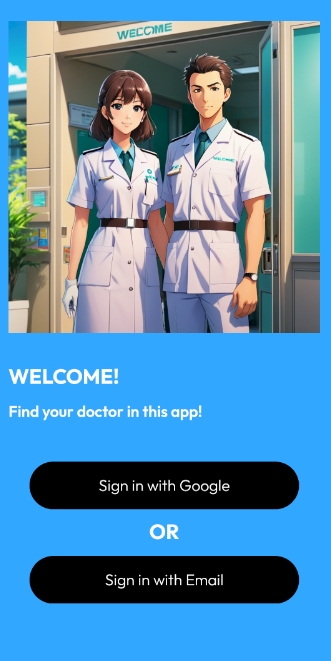
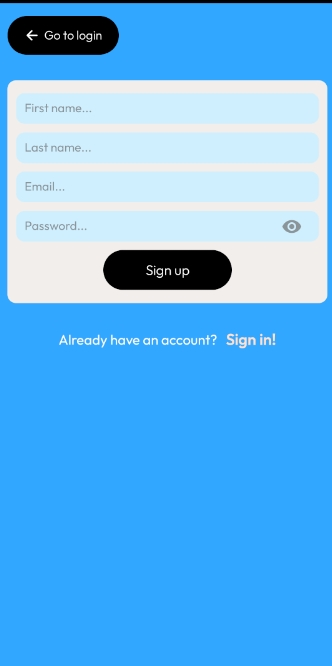
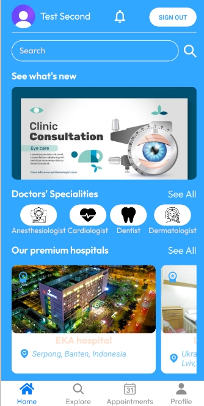
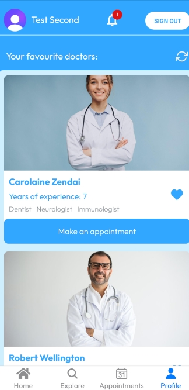
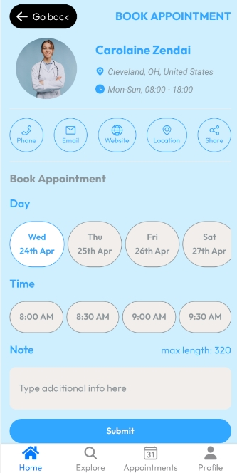
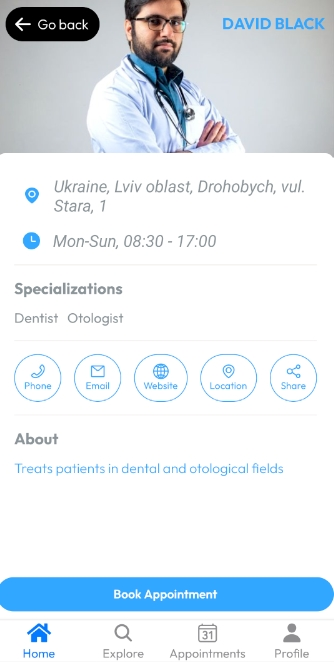

# Hospital App

         

# About

Hospital App is a React Native Android application made on Expo. User can register and login with real email and good password (verification required) or use personal Google Account.

This applications shows list of doctors and hospitals in choosen area, detailed info about each of them.

You can add doctors to favourites list and contact with them via phone or email. Also you can see their working location on Google maps, visit their provided website or share personal page with friends.

In this app you can book appointment with doctor or hospital in general: choose day of the current week and time, add some notes and doctor will be notified about this with your account name and email. User is free to delete appointment they made in Appointments screen. After you create or delete appointment, on your main page appears notification badge, and after reading new notifications they will be deleted.

Also you can search doctors or hospitals by their names via search bar or by specialities in categories screen.

On main page user can see the list of premium hospitals with special badge (advertisement) and look on animated slider with image that can contain info about discounts in hospitals and contests etc.

This is only pet project for training and showing my skills, so it isn't deployed on Google Play.
